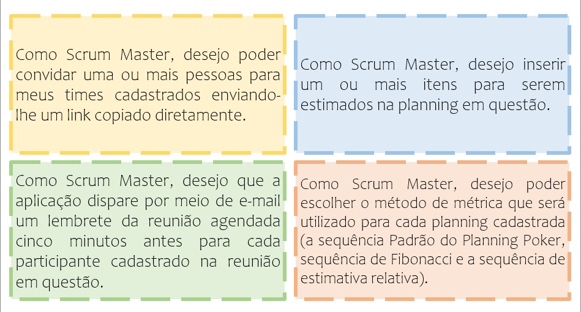
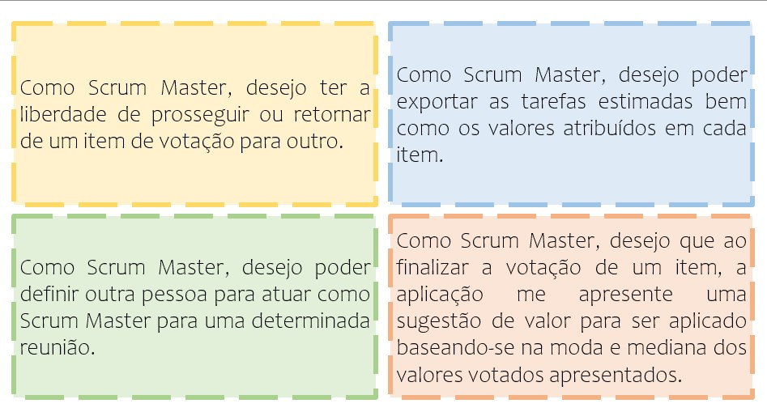
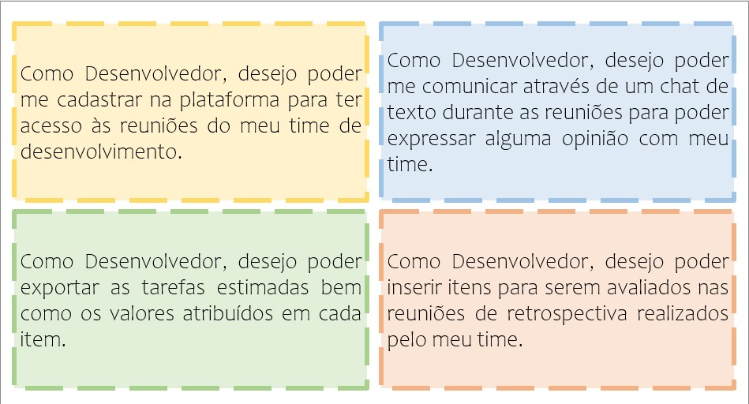
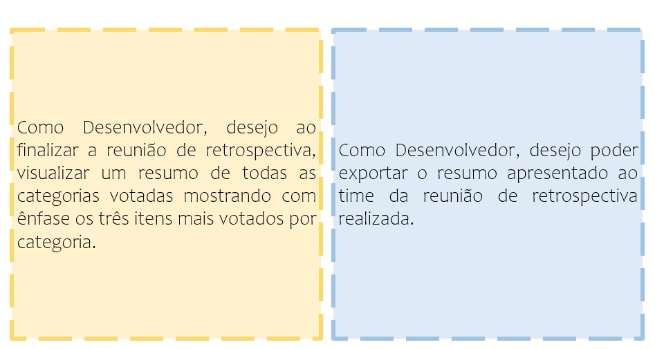
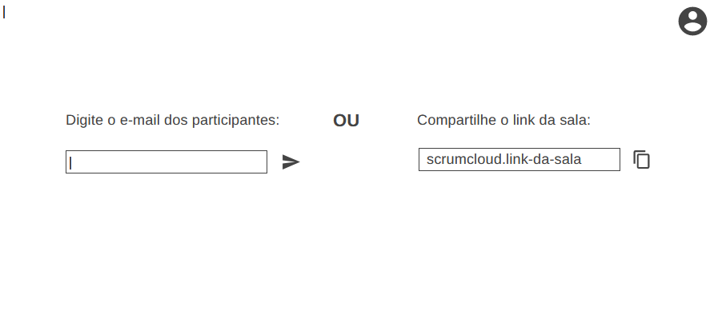
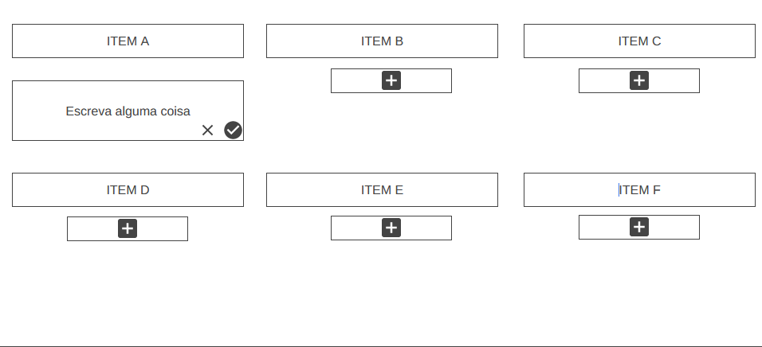
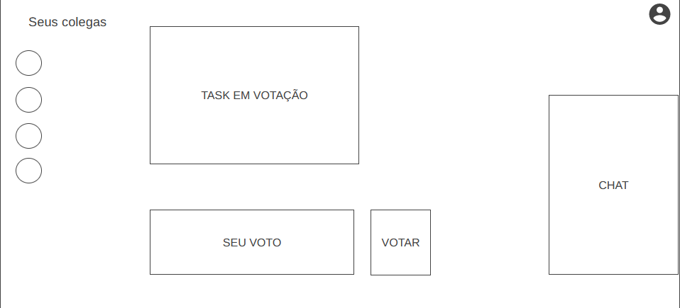

# Seja bem vindo ao 

### Olá! Somos a equipe Tetris responsáveis pelo desenvolvimento da aplicação web ScrumCloud.

 

#    O Time 

A equipe Tetris é composta pelos seguintes estudantes do 3º semestre de Banco de Dados pela FATEC de São José dos Campos:   

- ***Product Owner***
  - [Nágella Nasser](https://github.com/nagellanasser) [

](https://www.linkedin.com/in/nagellanasser/)  
- ***Scrum Master***
  - [Davi das Neves Machado](https://github.com/machadondavi) [

](https://www.linkedin.com/in/davinevesmachado/)
- ***Team Dev :***
  - [Alexia Karine Silva dos Santos](https://github.com/alexiakarine) [

](https://www.linkedin.com/in/alexia-karine-silva-5b0a79116/)
  - [Gabriel Oliveira Sana](https://github.com/gabsana) [

](https://www.linkedin.com/in/gabriel-sana-ba91a4147/)
  - [Guilherme de Oliveira Perfeito](https://github.com/guitambau) [

](https://www.linkedin.com/in/marcos-francisco-411800201)
  - [Jefferson Tavares de Araújo](https://github.com/jefferson-tavares-araujo) [

](https://www.linkedin.com/in/jeffersontavaresaraujo/)
  - [Renata Garcia Nonato](https://github.com/RenataGarciaNonato) [

](https://www.linkedin.com/mwlite/in/renata-garcia-2a84821b7)
  - [Valdiney José do Nascimento](https://github.com/Valdineynascimento) [

](https://www.linkedin.com/in/valdiney-jos%C3%A9-do-nascimento-68a136214/)

  

## :dart: Objetivo  
Desenvolver uma aplicação web que permita equipes remotas de desenvolvimento realizarem as cerimônias de Planning e Retrospective aplicadas na metodologia SCRUM.

Nossa aplicação permitirá o cadastro de membros de equipes, agendamento e realização (real-time) de reuniões com configuração de métricas customizáveis e exportação dos resumos para os integrantes das mesmas.

 

## :pencil: Requisitos funcionais 
- Cadastros de Usuários contendo (nome, e-mail e senha). 

- Existem dois perfis de usuário: 
  - Scrum Master 
  - Desenvolvedor 

- Por padrão, todos que se cadastram serão Scrum Masters. 

- O Scrum Master após se cadastrar poderá criar seu time no sistema. 

- O Scrum Master poderá incluir um ou mais integrante em seu time. 

- Ao inserir um integrante, o Scrum Master, irá inserir o nome e o e-mail deste integrante. 

- Após preencher os integrantes e salvar o time o sistema deverá disparar um e-mail para os integrantes realizarem o cadastro na plataforma. 

- Os usuários que forem cadastrados através do link que foi enviado por e-mail possuirão perfil de Desenvolvedor naquele time em que ele foi convidado. 

- O Scrum Master poderá convidar uma pessoa para seu time copiando diretamente o link do time e enviando da maneira como preferir. 

- O cadastro através do Link deverá possuir as mesmas mecânicas do cadastro por e-mail. 

- O sistema deverá permitir a criação das salas de Planning e de Retrospective. 

- Na sala de Planning, deverá ser permitido inserir um ou uma lista de itens que serão estimados. 

- Para a estimativa deverá ser utilizada técnicas como Planning Poker ou por tamanhos relativos. 

- Para o Planning Poker pode ser utilizada a frequência de Fibonacci ou as cartas padrão. 

- O sistema deverá trabalhar com um sistema de rodadas, ou seja, todos os itens inseridos na lista de estimativa serão estimados um por vez. 
 
- Neste sistema de rodadas, item atual deverá ficar em evidência na tela para que todos consigam ler. 

- Um sistema de chat em texto deverá ser implementado para comunicação na sala de estimativas. 

- Os participantes deverão escolher a carta para a estimativa e após selecioná-la um sistema de indicador deverá exibir quantas pessoas já escolheram as cartas e quantas faltam. 

- O Scrum Master terá acesso a uma funcionalidade onde ele poderá finalizar a votação, fazendo com que todas as cartas selecionadas sejam exibidas para todos os participantes. 

- O Scrum Master poderá então atribuir um valor para o item da rodada. 

- O Scrum Master poderá prosseguir para a próxima tarefa ou retornar a anterior. 

- As estimativas deverão ser salvas, permitindo que os usuários possam exportar as tarefas estimadas, bem como os valores atribuídos para os itens. 

- Na sala de retrospectiva, deverá ser permitido que cada participante da sala insira itens para serem avaliados. 

- Cada participante poderá inserir quantos itens quiser nas seguintes categorias nas reuniões de Retrospective: 
  - Parar de Fazer 
  - Diminuir a Frequência 
  - Manter a Frequência 
  - Aumentar a frequência 
  - Começar a fazer 

- Um sistema de chat de texto deverá ser implementado para a sala de Retrospective. 

- Os usuários poderão sinalizar que terminaram de preencher os itens nas reuniões de Retrospective. 

- Um indicador deverá ser exibido para todos os participantes da sala de Retrospective contendo a informação de quantos participantes finalizaram e quantos faltam. 

- O Scrum Master deverá ter acesso a um botão para iniciar a votação. 

- As rodadas da votação serão feitas por categoriasnas reuniões de Retrospective. 

- Durante a votação, nas reuniões de Retrospective, deverão ser exibidos o nome da categoria para todos os participantes, bem como todos os itens inseridos pelos participantes naquela categoria em questão. 

- Durante a votação, nas reuniões de Retrospective, os participantes poderão selecionar quais itens eles acham pertinente e sinalizar que finalizaram. 

- Nas reuniões de Retrospective, o Scrum Master poderá mover a votação para a próxima categoria e para a categoria anterior. 

- Após todas as categorias serem votadas, nas reuniões de Retrospective, um resumo de todas as categorias será exibida. 

- No resumo da reunião de Retrospective, somente os 3 itens mais votados serão exibidos por categoria. 

- O Scrum Master poderá finalizar a retrospectiva consolidando os itens mais votados. 

- Ao finalizar a retrospectiva o resumo poderá ser exportado. 

  
 

## :heavy_check_mark: Funcionalidades 

- Organizar de forma rápida as cerimônias de Planning e Retrospective praticadas na metodologia Scrum. 

- Cadastro de Usuários nos perfis de Scrum Master e Desenvolvedor. 

- Cadastro de Times de Desenvolvimento. 

- Links gerados e enviados automaticamente via e-mail para cada integrante do time cadastrado efetuar seu cadastro individual para acesso à plataforma. 

- Criação de salas de reunião de Planning ou Retrospective de forma imediata ou agendada, com métricas configuráveis, chat (real-time) e possibilidade de exportação dos dados ao final de cada reunião . 

- Possibilidade de enviar convite de uma sala de reunião via link. 

- Lembretes de reuniões agendadas enviadas 5 minutos antes de seu início ao e-mail de cada integrante. 

- Em reuniões de Planning,  a aplicação gerará uma sugestão de valor para atribuição final da task atual ao Scrum Master baseados na moda e mediana dos valores votados. 

- Em reuniões de Retrospective, será possível que cada integrante possa incluir tantos ítens quanto acharem necessários para cada categoria determinada para a reunião, assim como votar em tantos itens quanto acharem pertinentes durante a abordagem sobre cada categoria trabalhada. 

- Em cada item trabalhado nas reuniões de Planning e, em cada categoria pertinentes às reuniões de Retrospective, terão sua vizualização enfatizada na tela.

 

## :dart: Público-alvo 

Equipes de Desenvolvimento praticantes de metodologias ágeis que utilizam cerimônias de Planning e Retrospective do framework Scrum em seus projetos. 

 

## :computer: Tecnologias utilizadas 

- Git
- GitHub
- IDE Intellij || Backend
  - Linguagem de Programação: Java

- IDE Vs Code || Frontend
  - Linguagens:
    - Marcação: HTML5
    - Estilização: CSS3
    - Programação: Javascript

- BootStrap
- ReactJS
- Hibernate
- Spring Framework
- Banco de Dados: MySQL 

 

## :email: Entregas 

- **SPRINT 1** :heavy_check_mark:
   - Product Backlog
   - Wireframes
   - User stories
   - Sprint planning
   - Criação da base da aplicação - frontend 
   - Criação da base da aplicação - backend
   - MER

    

- **SPRINT 2** :hourglass:
   - Permitir cadastro de Usuário
   - Permitir cadastro de Times de Desenvolvimento 
   - Disparar e-mails com links para cadastramento
   - Permitir criar sala de reunião
   - Permitir incluir itens para votação em reuniões de Planning
   - Permitir definir métrica de votação
   - Permitir encerramento da votação de um item
   - Gerar sugestão de valor para o item em questão pós encerramento de votação dele para o S.M.
   - Permitir definição de um valor ao item com votação encerrada

  

- **SPRINT 3** :hourglass:
   - Gerar link de reuniões marcadas para ser compartilhado
   - Permitir definir Scrum Master da reunião
   - Evidenciar na tela item em votação
   - Permitir conversa entre participantes
   - Permitir retornar ou avançar item da lista de votação
   - Permitir visualização de votos após encerramento de votação do item
   - Permitir incluir itens para votação em reuniões de Retrospective
   - Permitir sinalização de termino de inserção de itens por usuário nas reuniões de Retrospective

   

- **SPRINT 4** :hourglass:
   - Permitir exportar os item votados e seus valores
   - Permitir sinalização de termino de itens da categoria em questão discutida.
   - Permitir a sinalização de 0 ao número total de itens da categoria em questão discutida na reunião de Retrospective
   - Gerar um resumo de todas as categorias votadas com ênfase nos três itens mais votados de cada categoria
   - Permitir exportar resumo gerado ao final da reunião

   

## :page_with_curl: Product Backlog  

 

 

 

   

 

## :chart_with_upwards_trend: Users Stories 

 

 

 

 

 

 

   

 

## :pencil2: Modelagem Entidade-Relacionamento - MER 

- **Modelo Conceitual**
  
   
  

## :mortar_board: Wireframes 

- **01: Tela de Login** *- Sujeita a modificações*

  

- **02: Tela  de Cadastro do Time** *- Sujeita a modificações*

  

- **03: Tela de Cadastro do Usuário** *- Sujeita a modificações*

  

- **04: Tela Inicial** *- Sujeita a modificações*

  

- **05: Tela de Retrospectiva do Desenvolvedor** *- Sujeita a modificações*

  

- **06: Tela de Retrospectiva do Scrum Master** *- Sujeita a modificações*

  

- **07: Tela de Planning do Desenvolvedor** *- Sujeita a modificações*

  

- **08: Tela de Planning do Scrum Master** *- Sujeita a modificações*

  

